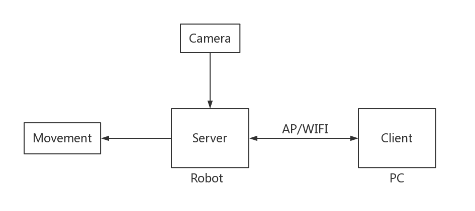
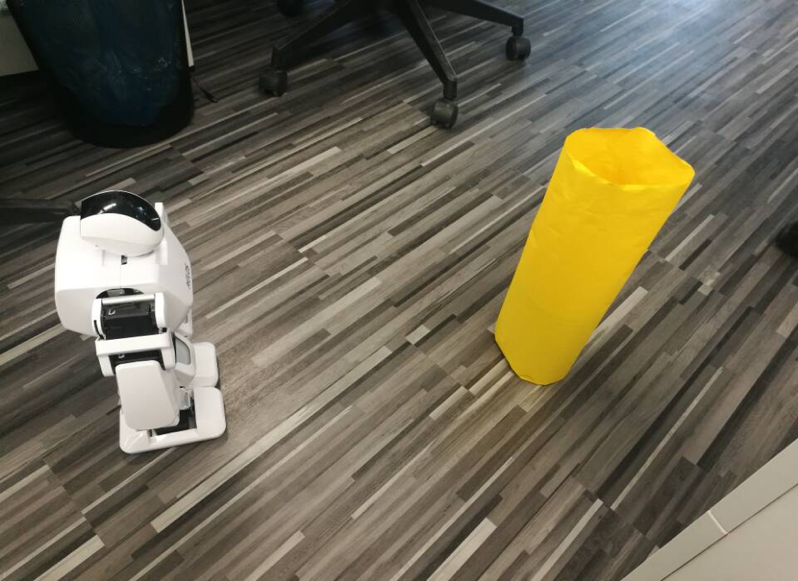
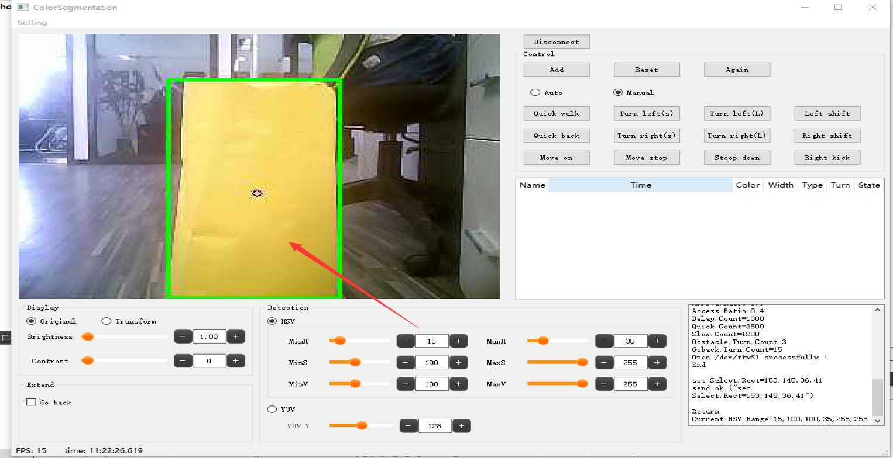

# Aelos-Vision-Demo

## 流程图

## 截图

## 硬件要求

- Aelos 视觉版 

## 软件环境

### Server(Linux)

- QT creator (version >= 5.3.2): `sudo apt-get install qt5-default`

### Client(Windows)

- QT creator: [download](https://www.qt.io/download)
- Opencv: (version=3.2.0)

## 安装

### 镜像安装

- TODO

### 编译源码

- Server
    - `cd robot-server/`
    - `qmake`
    - `make`

- Client
    - 在 QT-Creator 中打开 `pc-client/ColorSegmentation.pro` 编译

## 使用

- 登录机器人工具：Putty、SSH、SourceCRT
    - 例如 `ssh fa@192.168.x.x`
- 请参考 [视觉机器人使用手册](./doc/视觉机器人使用手册.pdf)

## QA

